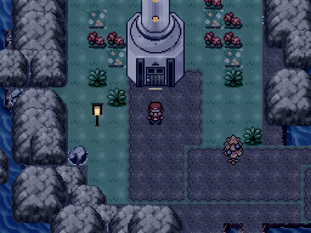

# Tidebound — The Keeper’s Light

A Pokémon fangame about companionship, loss, and a haunted coast that never sees
daylight. Begin with a bird in a dream, return to a lighthouse home, and follow
an ordinary errand toward the harbour.

Built with Pokémon Essentials 21.1 and mkxp-z.

<p align="center">
  
</p>

## Play

[Download the latest release](https://github.com/ziemniaki/tidebound/releases/latest)
for macOS (Intel or Apple Silicon), Windows x64, or Linux x86_64.
No development tools are needed. The demo includes the lighthouse opening,
coastal quests, hideout and southern pond; Psyduck Island is its endpoint.

## Development

Install [uv](https://docs.astral.sh/uv/getting-started/installation/) and
[Git](https://git-scm.com/downloads), then:

```sh
git clone https://github.com/ziemniaki/tidebound.git
cd tidebound
uv run play
```

This builds and opens a native development copy with **separate development
saves**. Python dependencies and runtime extraction are handled automatically.
Mac builds need Xcode command-line tools; Linux needs the documented
[system libraries](docs/players/linux.txt).

```sh
uv run build       # build without opening the game
uv run check       # verify changes; requires Node 24.14.1
```

[Development guide](docs/development.md) · [Working with an agent](docs/development.md#agent-assisted-development)
· [Architecture](docs/architecture.md) · [Releasing](docs/releasing.md)

## Project structure

| Directory | What belongs here |
| --- | --- |
| [`specs/`](specs/game-design.md) | Game design and creative decisions |
| [`docs/`](docs/README.md) | Development, playtesting, releases and current status |
| `src/` | Custom Ruby gameplay and presentation |
| `game/` | RPG Maker project, compiled data, PBS definitions and playable assets |
| `tools/` | Build commands, map/data generators and packaging |
| `tests/` | Headless checks and native runtime smoke tests |
| `assets/` | Editable art sources and export recipes |
| `runtime/` | Pinned engine inputs, patches and provenance |

Agents start with [AGENTS.md](AGENTS.md). Contributors should read the
[current status](docs/status.md) and preserve existing saves and creative direction.

## Feedback and credits

Report bugs through [GitHub Issues](https://github.com/ziemniaki/tidebound/issues),
including the game version, operating system and steps to reproduce.

Unofficial fan project. [Credits and third-party attribution](docs/credits.md)
apply; this repository does not grant rights to Pokémon or other third-party assets.
