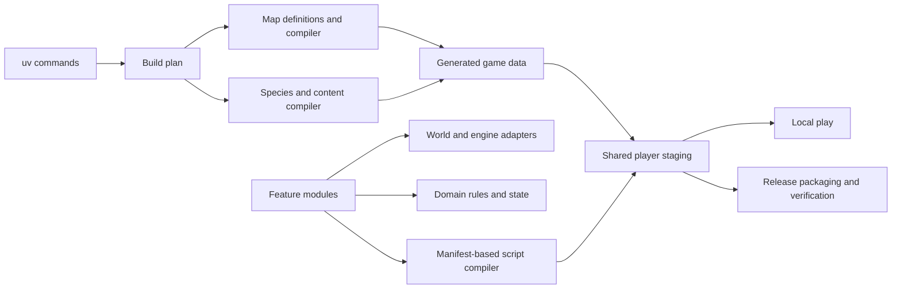

# Refactoring audit and plan

Status: proposed implementation plan. Audit completed 2026-09-26 against
`0f6a91a9d8d1d939f0c2e7cd3927af3b41073539` (main after PR #13).

The main problem is implicit ownership and execution order. Moving files alone
will not solve it. Map builders share mutable globals, regional data builders
chain executable scripts, and later game features override earlier features.
The project is small enough to replace these patterns with ordinary modules,
explicit inputs and a few shared operations.

The requested policy permits breaking obsolete compatibility and removing legacy
code. Retaining old entry points, old save migrations or old script filenames is
not a goal. Preserve the current game design and required Essentials integration;
remove historical scaffolding instead of extending it.

## Scope and evidence

Tracked inventory: 25 Ruby source files (3,780 lines), 45 Python tooling files
(3,971 lines), and 72 test source files (5,584 lines). Generated reports, extracted
engine references and vendor engine code are excluded from the tooling/test
counts. There are 69 tracked files under `docs/history/`.

This is a structural audit: import/call-site inspection, generator and loading
order tracing, representative implementation comparisons, and review of current
test/CI entry points. Ten `exec(...)` calls and eleven `runpy.run_path(...)` calls
occur in the Python tooling. Findings below distinguish demonstrable structure
from proposed design. Priorities rank refactoring value, not runtime defect
severity. No gameplay, generated assets or workflows changed during this audit;
no new platform build or playthrough was run. PR #13 supplies the recent baseline
verification, not proof of the proposed refactors.

## Findings

### R1 — High: map generation is one program split through shared globals

Evidence: [tools/rebuild_maps.py:339](https://github.com/ziemniaki/tidebound/blob/0f6a91a9d8d1d939f0c2e7cd3927af3b41073539/tools/rebuild_maps.py#L339), [tools/rebuild_maps.py:374](https://github.com/ziemniaki/tidebound/blob/0f6a91a9d8d1d939f0c2e7cd3927af3b41073539/tools/rebuild_maps.py#L374),
[tools/lighthouse_interiors.py:192](https://github.com/ziemniaki/tidebound/blob/0f6a91a9d8d1d939f0c2e7cd3927af3b41073539/tools/lighthouse_interiors.py#L192), [tools/dock_details.py:3](https://github.com/ziemniaki/tidebound/blob/0f6a91a9d8d1d939f0c2e7cd3927af3b41073539/tools/dock_details.py#L3).

The entry script constructs maps at module scope, executes ten fragments into
shared namespaces, then saves them. Fragments assume names such as `GAME`, `Map`,
`road`, `MAPS` and `surface` exist. `dock_details.py` and
`lighthouse_interiors.py` define different functions named `surface` in that same
namespace. Tilesets and images are written before `build()` is called. Importing
the builder is consequently not a harmless way to reuse its `Map` class.

**Refactor:** extract the small map model and RGSS serializer; make each area a
normal `build_area(assets) -> maps` function with explicit imports. Separate map
construction, tileset construction, rendering and publication. One compiler
collects the results and writes outputs after validation. Keep readable Python
map definitions; a new map-description language is unnecessary.

**Done when:** importing map modules creates no files; one area can be constructed
in a test without executing the others; there is no dynamic `exec`; full
regeneration preserves game data and decoded image pixels.

### R2 — High: species definitions and serialization are repeated across scripts

Evidence: [tools/rebuild_regional_data.py:7](https://github.com/ziemniaki/tidebound/blob/0f6a91a9d8d1d939f0c2e7cd3927af3b41073539/tools/rebuild_regional_data.py#L7),
[tools/rebuild_regional_data.py:52](https://github.com/ziemniaki/tidebound/blob/0f6a91a9d8d1d939f0c2e7cd3927af3b41073539/tools/rebuild_regional_data.py#L52), [tools/rebuild_wurmple_data.py:26](https://github.com/ziemniaki/tidebound/blob/0f6a91a9d8d1d939f0c2e7cd3927af3b41073539/tools/rebuild_wurmple_data.py#L26),
[tools/rebuild_glaciverm_data.py:100](https://github.com/ziemniaki/tidebound/blob/0f6a91a9d8d1d939f0c2e7cd3927af3b41073539/tools/rebuild_glaciverm_data.py#L100), [tools/rebuild_lapras_data.py:8](https://github.com/ziemniaki/tidebound/blob/0f6a91a9d8d1d939f0c2e7cd3927af3b41073539/tools/rebuild_lapras_data.py#L8),
[tools/rebuild_whyduck_data.py:68](https://github.com/ziemniaki/tidebound/blob/0f6a91a9d8d1d939f0c2e7cd3927af3b41073539/tools/rebuild_whyduck_data.py#L68).

Eight regional/species builder scripts repeatedly load, mutate and save the same
species database. The regional builder invokes Wurmple, which invokes Glaciverm,
which invokes Nivalora. Some invoke artwork recipes as another side effect.
Several authors describe the same fields twice: as Ruby Marshal attributes and
as manually assembled PBS text. A new form currently requires understanding both
representations and the invocation chain.

**Refactor:** one regional-data compiler with species/form records, one PBS writer,
one compiled-data adapter, and explicit artwork export tasks. Read each database
once, apply definitions, validate relationships, then write it once. Keep species
content in small named modules or plain records; consolidate the machinery rather
than putting every species into a giant script. Both output formats should derive
from the same record, including inherited fields and reverse evolution links.

**Done when:** adding a form needs a definition, not another executable builder;
all existing species/native-object and PBS compiler checks still pass; no nested
`runpy` chain remains.

### R3 — High: quest behavior is assembled by overriding earlier implementations

Evidence: [src/008_NeighborQuest.rb:191](https://github.com/ziemniaki/tidebound/blob/0f6a91a9d8d1d939f0c2e7cd3927af3b41073539/src/008_NeighborQuest.rb#L191),
[src/008_NeighborQuest.rb:273](https://github.com/ziemniaki/tidebound/blob/0f6a91a9d8d1d939f0c2e7cd3927af3b41073539/src/008_NeighborQuest.rb#L273), [src/011_VaultVisit.rb:109](https://github.com/ziemniaki/tidebound/blob/0f6a91a9d8d1d939f0c2e7cd3927af3b41073539/src/011_VaultVisit.rb#L109),
[src/023_Hideout.rb:161](https://github.com/ziemniaki/tidebound/blob/0f6a91a9d8d1d939f0c2e7cd3927af3b41073539/src/023_Hideout.rb#L161).

`NeighborOpeningHooks` and `VaultOpeningHooks` intercept the same opening NPC
interactions. `TideboundHideoutQuest` completely replaces `runner`, `second_thief`
and `overhear` without calling `super`, leaving the earlier implementations in
the source. An editor can change believable, substantial quest code that is never
used by normal runtime calls. The current method lookup chain also determines
which reward or dialogue takes precedence.

**Refactor:** put hideout interactions in Hideout, update generated event calls
and tests directly, and delete the three replaced methods and compatibility
wrapper. Give the oil seller and mother explicit interaction dispatch functions
whose ordered conditions are visible in one place. Feature modules can expose
small operations or interaction results; they should not prepend into each other.
Keep `prepend` where it actually adapts Essentials engine behavior.

**Done when:** each public story interaction has one effective implementation;
loading another feature cannot silently replace it; current quest transitions,
retry behavior and rewards remain covered.

### R4 — High: the test bootstrap does not represent the shipped composition

Evidence: [tests/native_domain.cjs:25](https://github.com/ziemniaki/tidebound/blob/0f6a91a9d8d1d939f0c2e7cd3927af3b41073539/tests/native_domain.cjs#L25), [tests/native_domain.cjs:95](https://github.com/ziemniaki/tidebound/blob/0f6a91a9d8d1d939f0c2e7cd3927af3b41073539/tests/native_domain.cjs#L95),
[tests/native_domain.cjs:101](https://github.com/ziemniaki/tidebound/blob/0f6a91a9d8d1d939f0c2e7cd3927af3b41073539/tests/native_domain.cjs#L101), [tests/neighbor_flow.rb:34](https://github.com/ziemniaki/tidebound/blob/0f6a91a9d8d1d939f0c2e7cd3927af3b41073539/tests/neighbor_flow.rb#L34),
[tests/regional_snakes.cjs:1](https://github.com/ziemniaki/tidebound/blob/0f6a91a9d8d1d939f0c2e7cd3927af3b41073539/tests/regional_snakes.cjs#L1).

The native-object harness loads NeighborQuest and runs its story tests before
loading Hideout, although the shipped archive loads all custom scripts before
Main. Those tests exercise the old overridden methods identified in R3. The
harness also slices a source file at the comment `# The generated maps`, extracts
save-registration source with a regular expression, and selects stock scripts
by numeric archive positions. Multiple JavaScript runners repeat Ruby VM setup.
A harmless source move or comment edit can change what gets tested.

**Refactor:** share a small VM/engine-fixture loader with named engine entries and
an explicit source manifest. Test pure rules independently; integration suites
must load the same complete feature composition as the game. Move Ruby test
bodies out of JavaScript strings where practical. Replace text slicing with real
module boundaries and fixtures that model supported engine APIs.

**Done when:** a current necklace quest test uses the final Hideout methods; no
production source is split on comments or scraped into partial Ruby definitions;
adding a game source file cannot omit it silently from integration coverage.
This is the first implementation step, before structural game changes.

### R5 — High: Opening owns infrastructure needed by unrelated features

Evidence: [src/004_Opening.rb:17](https://github.com/ziemniaki/tidebound/blob/0f6a91a9d8d1d939f0c2e7cd3927af3b41073539/src/004_Opening.rb#L17), [src/004_Opening.rb:49](https://github.com/ziemniaki/tidebound/blob/0f6a91a9d8d1d939f0c2e7cd3927af3b41073539/src/004_Opening.rb#L49),
[src/006_FirstWalk.rb:8](https://github.com/ziemniaki/tidebound/blob/0f6a91a9d8d1d939f0c2e7cd3927af3b41073539/src/006_FirstWalk.rb#L8), [src/008_NeighborQuest.rb:17](https://github.com/ziemniaki/tidebound/blob/0f6a91a9d8d1d939f0c2e7cd3927af3b41073539/src/008_NeighborQuest.rb#L17),
[src/022_DemoLaunch.rb:39](https://github.com/ziemniaki/tidebound/blob/0f6a91a9d8d1d939f0c2e7cd3927af3b41073539/src/022_DemoLaunch.rb#L39), [src/025_Pond.rb:23](https://github.com/ziemniaki/tidebound/blob/0f6a91a9d8d1d939f0c2e7cd3927af3b41073539/src/025_Pond.rb#L23).

Travel and shared story-state access live in Opening; actor lookup and animation
live in FirstWalk while reopening the Opening module. Pond and dock battles ask
NeighborQuest whether the party is able to fight. Thus a pond change depends on
opening and necklace-quest implementation details. Map/event IDs, actor display
names, coordinates and battle outcomes also appear directly in feature code and
Python-generated event strings.

**Refactor:** extract a small engine/world boundary for travel, actor operations
and battles; let features own their own state and transitions. Keep shared state
access at the existing domain root rather than routing it through Opening.
Introduce named map/actor references at the Python/Ruby boundary with generated
lookup data where both languages need them. Start with the cross-feature calls
above, not a universal quest framework or a global service container.

**Done when:** Pond and docks no longer depend on NeighborQuest; moving opening
code does not alter shared travel or actor behavior; generated event references
are validated against the runtime interface.

### R6 — Medium: obsolete compatibility is woven into normal gameplay

Evidence: [src/004_Opening.rb:21](https://github.com/ziemniaki/tidebound/blob/0f6a91a9d8d1d939f0c2e7cd3927af3b41073539/src/004_Opening.rb#L21), [src/007_Coast.rb:28](https://github.com/ziemniaki/tidebound/blob/0f6a91a9d8d1d939f0c2e7cd3927af3b41073539/src/007_Coast.rb#L28),
[src/015_Frostcoon.rb:27](https://github.com/ziemniaki/tidebound/blob/0f6a91a9d8d1d939f0c2e7cd3927af3b41073539/src/015_Frostcoon.rb#L27), [src/019_DreamRoom.rb:316](https://github.com/ziemniaki/tidebound/blob/0f6a91a9d8d1d939f0c2e7cd3927af3b41073539/src/019_DreamRoom.rb#L316),
[src/023_Hideout.rb:17](https://github.com/ziemniaki/tidebound/blob/0f6a91a9d8d1d939f0c2e7cd3927af3b41073539/src/023_Hideout.rb#L17), [tests/create_old_dream_save.rb:1](https://github.com/ziemniaki/tidebound/blob/0f6a91a9d8d1d939f0c2e7cd3927af3b41073539/tests/create_old_dream_save.rb#L1).

Normal interaction and loading paths migrate opening revisions, offset old coast
coordinates, refresh provisional Frostcoon objects across storage, reload an old
dream map and relocate old hideout saves. Several fixtures require archives or
species data from old 0.7 releases. These are real legacy obligations, rather than
requirements of current story mechanics.

**Refactor:** remove pre-refactor save conversion paths and tests that exist only
to prove them. Define one explicit supported save version for the new structure;
reject an incompatible save clearly instead of trying to interpret it as current
state. Do not delete existing save files. Initialize fresh games directly with
the current state model. Separate Frostcoon's current evolution behavior from its
old-species refresh code before deleting the refresh module.

**Done when:** new saves round-trip correctly and unsupported versions have one
clear boundary; feature methods no longer carry historical revision branches.
No new migration layer is introduced merely to preserve obsolete internals.

### R7 — Medium: generated data, handwritten source and engine patches share a boundary

Evidence: [tools/psychic_maze.py:43](https://github.com/ziemniaki/tidebound/blob/0f6a91a9d8d1d939f0c2e7cd3927af3b41073539/tools/psychic_maze.py#L43), [src/018_PsychicMaze.rb:3](https://github.com/ziemniaki/tidebound/blob/0f6a91a9d8d1d939f0c2e7cd3927af3b41073539/src/018_PsychicMaze.rb#L3),
[tools/rebuild_maps.py:395](https://github.com/ziemniaki/tidebound/blob/0f6a91a9d8d1d939f0c2e7cd3927af3b41073539/tools/rebuild_maps.py#L395), [tools/pond_map.py:94](https://github.com/ziemniaki/tidebound/blob/0f6a91a9d8d1d939f0c2e7cd3927af3b41073539/tools/pond_map.py#L94),
[tools/rebuild_scripts.py:17](https://github.com/ziemniaki/tidebound/blob/0f6a91a9d8d1d939f0c2e7cd3927af3b41073539/tools/rebuild_scripts.py#L17), [tools/script_archive.py:15](https://github.com/ziemniaki/tidebound/blob/0f6a91a9d8d1d939f0c2e7cd3927af3b41073539/tools/script_archive.py#L15).

The maze generator rewrites a marked section inside a handwritten Ruby file.
Other generated Ruby sits alongside ordinary numbered source files. The script
builder also patches stock engine source using replacements while embedding the
custom files. Numeric filenames simultaneously describe a historical sequence,
control runtime ordering and become assumptions in test loaders.

**Refactor:** give generated Ruby a dedicated directory and generate whole files.
Use an explicit load manifest for readable feature paths; archive compilation
must consume that manifest and reject missing, duplicate or unlisted sources.
Move necessary stock-engine patches to a small named adapter/patch step with
explicit expected targets. Keep required stock engine inputs until a real
replacement source/build path exists; they are not disposable generated output.

**Done when:** generators never edit handwritten source; a feature can be renamed
without changing behavior accidentally; required engine modifications have one
visible owner and fail if their expected target no longer matches.

### R8 — Medium: the rebuild task list is duplicated and tooling is only partly a package

Evidence: [tools/tidebound_dev/cli.py:16](https://github.com/ziemniaki/tidebound/blob/0f6a91a9d8d1d939f0c2e7cd3927af3b41073539/tools/tidebound_dev/cli.py#L16), [tools/check_rebuild.py:10](https://github.com/ziemniaki/tidebound/blob/0f6a91a9d8d1d939f0c2e7cd3927af3b41073539/tools/check_rebuild.py#L10),
[tools/tidebound_dev/cli.py:70](https://github.com/ziemniaki/tidebound/blob/0f6a91a9d8d1d939f0c2e7cd3927af3b41073539/tools/tidebound_dev/cli.py#L70), [tools/verify.py:31](https://github.com/ziemniaki/tidebound/blob/0f6a91a9d8d1d939f0c2e7cd3927af3b41073539/tools/verify.py#L31).

The developer CLI and isolated rebuild checker keep separate ordered generator
lists. Most tooling remains top-level executable files imported through
`sys.path` manipulation, while only the command entry point is a normal Python
package. Data writers execute as scripts instead of offering callable operations.
There is no single declaration of build inputs, tasks and outputs.

**Refactor:** move reusable operations into the existing `tidebound_dev` package;
keep the CLI thin. One explicit build plan should drive rebuild, isolated
regeneration and CI. Pass repository/output paths into operations rather than
reading module globals. Remove obsolete script entry points as callers move; a
permanent layer of compatibility launchers is unnecessary.

**Done when:** adding a generator changes one task declaration; functions can run
against a temporary project; imports neither run generators nor mutate `sys.path`.
Do not build a general task scheduler to replace a short ordered pipeline.

### R9 — Medium: cross-platform packaging shares code through the Mac packager

Evidence: [tools/package_mac.py:20](https://github.com/ziemniaki/tidebound/blob/0f6a91a9d8d1d939f0c2e7cd3927af3b41073539/tools/package_mac.py#L20), [tools/package_windows.py:11](https://github.com/ziemniaki/tidebound/blob/0f6a91a9d8d1d939f0c2e7cd3927af3b41073539/tools/package_windows.py#L11),
[tools/package_linux.py:11](https://github.com/ziemniaki/tidebound/blob/0f6a91a9d8d1d939f0c2e7cd3927af3b41073539/tools/package_linux.py#L11), [tools/package_windows.py:37](https://github.com/ziemniaki/tidebound/blob/0f6a91a9d8d1d939f0c2e7cd3927af3b41073539/tools/package_windows.py#L37),
[tools/package_linux.py:37](https://github.com/ziemniaki/tidebound/blob/0f6a91a9d8d1d939f0c2e7cd3927af3b41073539/tools/package_linux.py#L37), [tools/build_release.py:25](https://github.com/ziemniaki/tidebound/blob/0f6a91a9d8d1d939f0c2e7cd3927af3b41073539/tools/build_release.py#L25).

Windows/Linux builders import archive, file-list and hashing helpers from
`package_mac`. Each builder separately implements staging, copying, provenance,
ZIP roundtrip checks, manifests and publication. The code is not identical—the
platform differences are legitimate—but the ownership of common operations is
wrong and the repeated transaction steps can drift.

**Refactor:** neutral archive/manifest helpers plus one packaging sequence with
explicit platform functions for runtime preparation, layout, signing and native
validation. A few functions and a small result/configuration record are enough.
Keep Mac signing/Unicode handling and Linux/Windows binary checks in their
platform modules; do not combine all branches into one giant platform switch.

**Done when:** other platforms do not import the Mac packager; staging and
publication have one owner; all platform-specific verification still runs.

### R10 — Medium: the local play loop pays for distribution packaging

Evidence: [tools/tidebound_dev/cli.py:65](https://github.com/ziemniaki/tidebound/blob/0f6a91a9d8d1d939f0c2e7cd3927af3b41073539/tools/tidebound_dev/cli.py#L65),
[tools/package_mac.py:168](https://github.com/ziemniaki/tidebound/blob/0f6a91a9d8d1d939f0c2e7cd3927af3b41073539/tools/package_mac.py#L168), [tools/package_windows.py:78](https://github.com/ziemniaki/tidebound/blob/0f6a91a9d8d1d939f0c2e7cd3927af3b41073539/tools/package_windows.py#L78).

Every `play` builds a release-style ZIP, verifies an extraction roundtrip, then
extracts it again into the development player. It subsequently changes the save
configuration and, on Mac, signs the copy again. This is unnecessary archive work
for a local edit/run cycle. The code path establishes the overhead; this audit did
not benchmark its duration.

**Refactor:** share a `stage_player` operation between development and release.
Development sets its namespace before final platform preparation and launches
the staged player directly. Release alone adds provenance manifests, archive
creation and roundtrip validation. Start with this simplification before adding
incremental-build caches or a file watcher.

**Done when:** `uv run play` creates no distribution ZIP; it still uses the same
runtime inputs and isolated development saves, and passes native developer smoke.
Measure cold and repeated build times on the same machine before/after.

### R11 — Medium: native smoke fixtures repeat setup while old visual tests have no common runner

Evidence: [tests/windows_runtime_smoke.py:35](https://github.com/ziemniaki/tidebound/blob/0f6a91a9d8d1d939f0c2e7cd3927af3b41073539/tests/windows_runtime_smoke.py#L35),
[tests/linux_runtime_smoke.py:35](https://github.com/ziemniaki/tidebound/blob/0f6a91a9d8d1d939f0c2e7cd3927af3b41073539/tests/linux_runtime_smoke.py#L35), [tests/mac_runtime_smoke.py:40](https://github.com/ziemniaki/tidebound/blob/0f6a91a9d8d1d939f0c2e7cd3927af3b41073539/tests/mac_runtime_smoke.py#L40),
[tests/prepare_native_neighbor.py:7](https://github.com/ziemniaki/tidebound/blob/0f6a91a9d8d1d939f0c2e7cd3927af3b41073539/tests/prepare_native_neighbor.py#L7), [tests/rendered_frostcoon.rb:1](https://github.com/ziemniaki/tidebound/blob/0f6a91a9d8d1d939f0c2e7cd3927af3b41073539/tests/rendered_frostcoon.rb#L1).

Current platform smoke scripts repeat extraction, manifest checking, save
namespace replacement, Main injection and cleanup. Separately, older visual
scripts assume hand-prepared copies, retained saves or earlier species data.
The neighbour preparer requires a separate engine directory and a
`chosen-party.rxdata` file. A contributor cannot discover one supported way to
run those feature tests.

**Refactor:** share disposable fixture preparation, then retain small native
platform launchers. Give useful current visual scenarios a named runner and
fixtures created from the current baseline. Remove obsolete snapshots and
old-version fixture makers rather than moving them into another archive folder.
Continue to distinguish domain tests, production-composition tests and rendered
native scenarios.

**Done when:** a documented command runs any supported scenario with no manual
engine copying; namespace isolation is implemented once; remaining historical
visual files are either made executable in that runner or deleted.

### R12 — Medium: presentation repeats sprite lifecycle code and sometimes controls collision

Evidence: [src/005_Presentation.rb:198](https://github.com/ziemniaki/tidebound/blob/0f6a91a9d8d1d939f0c2e7cd3927af3b41073539/src/005_Presentation.rb#L198), [src/005_Presentation.rb:221](https://github.com/ziemniaki/tidebound/blob/0f6a91a9d8d1d939f0c2e7cd3927af3b41073539/src/005_Presentation.rb#L221),
[src/005_Presentation.rb:265](https://github.com/ziemniaki/tidebound/blob/0f6a91a9d8d1d939f0c2e7cd3927af3b41073539/src/005_Presentation.rb#L265), [src/009_NeighborPresentation.rb:27](https://github.com/ziemniaki/tidebound/blob/0f6a91a9d8d1d939f0c2e7cd3927af3b41073539/src/009_NeighborPresentation.rb#L27),
[src/012_VaultPresentation.rb:2](https://github.com/ziemniaki/tidebound/blob/0f6a91a9d8d1d939f0c2e7cd3927af3b41073539/src/012_VaultPresentation.rb#L2).

Prop sprites repeat bitmap allocation/disposal, event positioning and visibility
handling. Some `update` methods also change the event's `through` flag, coupling
collision to sprite construction/update. Rendering helpers read feature-global
transient state and coordinates directly. The drawing instructions themselves
are meaningful art code and should not be collapsed into opaque configuration.

**Refactor:** one small owned-bitmap/event-position helper, with focused prop
renderers. Move event visibility/collision decisions to actor synchronization;
let sprites display that state. Keep distinct animation/drawing behavior explicit.
Avoid a deep sprite class hierarchy or a generic rendering framework.

**Done when:** shared resource ownership and positioning are tested once; disposing
a prop cannot leak its bitmap; constructing a sprite does not decide gameplay
passability. Compare representative rendered scenes after the change.

### R13 — Medium: compressed code makes real control flow difficult to review

Evidence: [tools/configure_game.py:12](https://github.com/ziemniaki/tidebound/blob/0f6a91a9d8d1d939f0c2e7cd3927af3b41073539/tools/configure_game.py#L12), [tools/rebuild_regional_data.py:18](https://github.com/ziemniaki/tidebound/blob/0f6a91a9d8d1d939f0c2e7cd3927af3b41073539/tools/rebuild_regional_data.py#L18),
[src/008_NeighborQuest.rb:286](https://github.com/ziemniaki/tidebound/blob/0f6a91a9d8d1d939f0c2e7cd3927af3b41073539/src/008_NeighborQuest.rb#L286), [src/009_NeighborPresentation.rb:4](https://github.com/ziemniaki/tidebound/blob/0f6a91a9d8d1d939f0c2e7cd3927af3b41073539/src/009_NeighborPresentation.rb#L4).

Long dictionary literals, multiple statements per line, compressed conditional
branches and single-letter names are common in handwritten code. Renaming files
will not fix this. There is no formatting/lint gate in the current quick workflow.
Dense generated lookup tables are a different case and need not be expanded by
hand.

**Refactor:** format handwritten Python/Ruby, expand state-changing branches, and
name intermediate values at the modules being extracted. Choose minimal,
project-owned formatting rules and add a cheap check. Keep formatting-only work
separate from behavioral changes so reviewers can see the latter. Do not add
line-count or abstraction-count targets.

**Done when:** normal edits preserve one readable style automatically; a routine
feature change has an intelligible diff without unrelated formatting churn.

### R14 — Low: retired tools and historical instructions still occupy the active tree

Evidence: [docs/history/README.md:1](https://github.com/ziemniaki/tidebound/blob/0f6a91a9d8d1d939f0c2e7cd3927af3b41073539/docs/history/README.md#L1),
[docs/history/retired-tools/finish_pond_release.py:1](https://github.com/ziemniaki/tidebound/blob/0f6a91a9d8d1d939f0c2e7cd3927af3b41073539/docs/history/retired-tools/finish_pond_release.py#L1),
[docs/history/retired-tools/Recovery/pond-0.8.4/restore_source.py:1](https://github.com/ziemniaki/tidebound/blob/0f6a91a9d8d1d939f0c2e7cd3927af3b41073539/docs/history/retired-tools/Recovery/pond-0.8.4/restore_source.py#L1),
[src/025_Pond.rb:1](https://github.com/ziemniaki/tidebound/blob/0f6a91a9d8d1d939f0c2e7cd3927af3b41073539/src/025_Pond.rb#L1).

The current checkout preserves one-time recovery scripts, duplicate source,
old agent guides and old verification reports. Their historical notices help,
but they still appear in broad searches. Pond's active source even says it is not
embedded until a recovery recipe runs, despite being part of the current game.
The history directory is approximately 646 KiB: this is a discoverability issue,
not a major repository-size problem.

**Refactor:** delete the retired tools, duplicated source and superseded operational
reports from the active tree, fixing incoming documentation links. Git history
already preserves them. Retain current design decisions, credits, licenses and
runtime provenance. Evaluate artwork inputs and stock assets by actual use, not
by an old-looking name or an unsuccessful text search.

**Done when:** default searches find current instructions and implementation;
there are no links to removed documents or comments instructing agents to run
retired recovery steps.

## Target structure

Use the existing languages and uv workflow. Keep the number of concepts small.
This is a proposed responsibility map, not a requirement to create every example
file before it has a useful owner.

```text
src/
  load_order.txt                  # explicit archive embedding order
  tidebound/
    domain/                       # rules and persistent game state
    engine/                       # Essentials hooks and native adapters
    world/                        # travel, actors, map/terrain interfaces
    features/                     # opening, dreams, neighbour, hideout, vault, pond
    presentation/                 # shared sprite/scene support
  generated/                      # complete generated Ruby data files

tools/tidebound_dev/
  cli.py                          # existing user-facing commands
  pipeline.py                     # one explicit rebuild plan
  maps/                           # model, serializer, area definitions, renderer
  data/                           # definitions and common PBS/Marshal writers
  assets/                         # callable export operations
  packaging/                      # shared staging + Mac/Windows/Linux adapters

tests/
  support/                        # VM loader, engine doubles, native fixtures
  domain/                         # isolated rules
  integration/                    # complete current feature composition
  native/                         # supported rendered scenarios/platform launchers
  tooling/                        # Python tooling tests

game/                             # engine-compatible project/output layout
assets/                           # source artwork
specs/                            # creative/game specification
docs/                             # current development, decisions and player docs
```

Features can have their own dialogue/view files when separation helps. Do not
introduce a global dialogue database, generic quest engine, dependency-injection
container or plugin discovery system merely to reduce filenames. The useful
abstractions here are concrete: `Map`, species definitions, a build plan,
`stage_player`, actor operations, and owned sprite resources.



## Implementation order and acceptance

| PR | Scope | Required evidence |
| --- | --- | --- |
| 1 | Correct current integration composition; remove overridden quest methods/wrapper; update event calls (R4, then R3's dead code) | Current necklace/hideout path, loss/draw/cancel/retry and full-bag cases use the final implementation; script/map agreement |
| 2 | Establish one Python package/build plan and shared map model; replace map `exec` chain (R8, R1) | Import-without-writes checks, isolated area construction, full regeneration with identical data/pixels |
| 3 | Replace regional script chain with definitions and common writers (R2) | Compiled data equivalence, native species/evolution checks, PBS compiler agreement |
| 4 | Extract shared player staging/packaging and smoke preparation; simplify local play (R9–R11) | All native platforms, signing/relocation checks, failure cleanup, measured local build comparison |
| 5 | Explicit Ruby manifest and generated directory; world/feature ownership and interaction dispatch (R7, R5, remaining R3) | Same complete source composition in game/tests; current game flows and native startup/render checks |
| 6 | Remove unsupported save compatibility and old fixtures; deduplicate sprite support (R6, R12) | Current-save roundtrip, explicit version boundary, rendered scene comparison and disposal checks |

R13 accompanies the relevant modules in separate formatting commits. R14 is an
independent deletion-only cleanup after its incoming links are updated. Each PR
should remove the replaced path instead of adding a second supported architecture.
Build-definition changes require a full branch-dispatched verification run;
ordinary refactoring does not justify running the expensive matrix on every push.

Update AGENTS.md and architecture/testing docs as each boundary changes. In
particular, replace the old blanket requirement to retain historic save and
numeric-filename compatibility with the approved support policy. Agent guidance
should describe the architecture that exists, not preserve the audit's old paths.

Start with PR 1. The corrected integration baseline makes deletion and larger
reorganization verifiable. Then the map/compiler work removes the largest hidden
dependency cluster. Defer engine replacement, new environment managers, cache
frameworks and a broad asset purge until a specific need justifies them.
